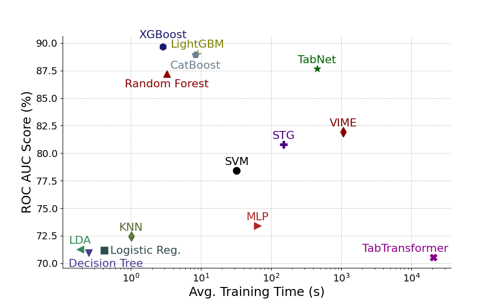
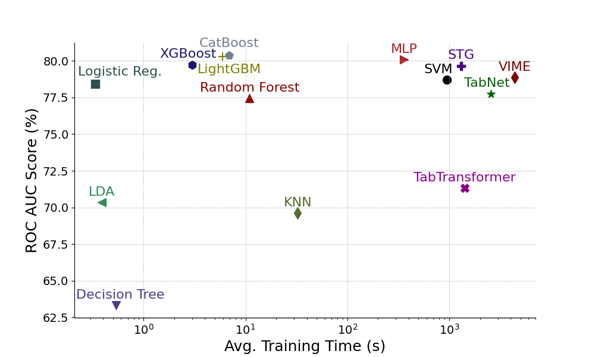

# Performance Benchmark on Medical Diagnosis over Tabular Data

This is the GitHub repository for the [paper](https://ieeexplore.ieee.org/abstract/document/11114069): A. Yarkın Yıldız, and Asli Kalayci. "Gradient boosting decision trees on medical diagnosis over tabular data." 2025 IEEE International Conference on AI and Data Analytics (ICAD). IEEE, 2025.

This repository includes all the experiments conducted for the medical diagnosis tasks. Results for the tabular deep learning and machine learning (including GBDTs) models are evaluated in the respective folders in `DL/` and `ML/`. Refer to the `README.md` files inside these folders for more information.

## Cite

Please cite this work if you intend to use this code for your research:

```bib
@inproceedings{yildiz2025gradient,
  title={Gradient boosting decision trees on medical diagnosis over tabular data},
  author={Y{\i}ld{\i}z, A Yark{\i}n and Kalayci, Asli},
  booktitle={2025 IEEE International Conference on AI and Data Analytics (ICAD)},
  pages={1--8},
  year={2025},
  organization={IEEE}
}
```

## Datasets

| **Dataset**                | **Samples** | **Features** | **Classes** | **Task**       |
|----------------------------|-------------|--------------|-------------|----------------|
| Cardiovascular Disease     | 70k         | 12           | 2           | Binary         |
| Heart Failure              | 299         | 13           | 2           | Binary         |
| Parkinsons                 | 195         | 23           | 2           | Binary         |
| EEG Eye State              | 15k         | 15           | 2           | Binary         |
| Eye Movements              | 11k         | 28           | 3           | Multi-Class    |
| Arcene                     | 200         | 10k          | 2           | Binary         |
| Prostate                   | 102         | 12k          | 2           | Binary         |

## Requirements

Experiments are conducted in Linux, with the packages stated in both `environment.yml` and `requirements.txt`.

## Results

### Numerical Results

The table below shows the 8-fold cross-validation ROC AUC scores for traditional ML models, state-of-the-art tabular deep learning (DL) methods, and gradient-boosted decision tree (GBDT) models on different datasets. Higher scores are better. The best scores are **bolded**, and the second bests are *italicized*.

| Model                     | CD                        | Heart Failure             | Parkinsons                | EEG Eye State             | Eye Movements             | Arcene                   | Prostate                 | Avg. Rank |
|---------------------------|---------------------------|---------------------------|---------------------------|---------------------------|---------------------------|--------------------------|--------------------------|-----------|
| SVM                        | 78.715 ± 0.005            | 86.389 ± 0.048            | 88.791 ± 0.068            | 70.752 ± 0.013            | 78.405 ± 0.007            | 87.094 ± 0.043           | 91.419 ± 0.096           | 9.857     |
| Logistic Reg.              | 78.435 ± 0.005            | 87.571 ± 0.051            | 90.875 ± 0.041            | 61.125 ± 0.014            | 71.180 ± 0.009            | **95.211 ± 0.031**        | 95.089 ± 0.065           | 8.143     |
| KNN                        | 69.611 ± 0.006            | 77.529 ± 0.067            | 96.857 ± 0.023            | 91.185 ± 0.005            | 72.448 ± 0.009            | 90.869 ± 0.065           | 87.822 ± 0.112           | 9.857     |
| Random Forest              | 77.464 ± 0.005            | 91.233 ± 0.038            | 96.068 ± 0.033            | **98.404 ± 0.002**        | 87.234 ± 0.007            | 91.153 ± 0.034           | 93.155 ± 0.078           | 6.000     |
| Decision Tree              | 63.325 ± 0.006            | 71.646 ± 0.051            | 81.287 ± 0.060            | 83.781 ± 0.008            | 70.951 ± 0.009            | 72.037 ± 0.116           | 80.357 ± 0.106           | 12.714    |
| LDA                        | 70.363 ± 0.005            | 87.896 ± 0.053            | 88.609 ± 0.060            | 67.130 ± 0.014            | 71.273 ± 0.010            | 69.927 ± 0.124           | 93.849 ± 0.060           | 10.571    |
| MLP                        | 80.090 ± 0.005            | 87.288 ± 0.056            | 97.186 ± 0.022            | 95.513 ± 0.006            | 73.397 ± 0.015            | 93.669 ± 0.042           | 89.881 ± 0.108           | 6.429     |
| STG                        | 79.667 ± 0.004            | 86.241 ± 0.058            | 95.352 ± 0.038            | 84.854 ± 0.011            | 80.780 ± 0.006            | 90.584 ± 0.062           | 94.048 ± 0.094           | 7.857     |
| TabNet                     | 77.757 ± 0.004            | **93.319 ± 0.037**        | **99.446 ± 0.012**        | 62.441 ± 0.040            | 87.673 ± 0.008            | 87.662 ± 0.098           | 66.865 ± 0.205           | 7.429     |
| TabTransformer             | 71.327 ± 0.123            | 87.642 ± 0.069            | 96.625 ± 0.027            | 79.646 ± 0.039            | 70.534 ± 0.010            | *94.724 ± 0.051*          | 92.956 ± 0.107           | 8.571     |
| VIME                       | 78.882 ± 0.004            | 85.758 ± 0.047            | 98.532 ± 0.016            | 92.473 ± 0.005            | 81.918 ± 0.008            | 91.721 ± 0.070           | 52.679 ± 0.164           | 7.429     |
| XGBoost                    | 79.745 ± 0.004            | 90.478 ± 0.025            | 97.265 ± 0.023            | *98.331 ± 0.002*          | **89.675 ± 0.008**        | 89.123 ± 0.047           | 94.940 ± 0.055           | 4.429     |
| LightGBM                   | *80.296 ± 0.004*          | *91.490 ± 0.027*          | *98.623 ± 0.015*          | 97.008 ± 0.004            | *89.059 ± 0.007*          | 91.883 ± 0.043           | *95.486 ± 0.052*         | **2.571**  |
| CatBoost                   | **80.378 ± 0.004**        | 91.056 ± 0.034            | 97.740 ± 0.014            | 97.739 ± 0.003            | 88.954 ± 0.006            | 91.396 ± 0.040           | **96.379 ± 0.053**        | *3.143*    |

### Visualizations

Here are two example plots for Cardiovascular Disease and Eye Movements datasets that visualizes the trade-off between ROC AUC score and training time for all models.

**Cardiovascular Disease:**


**Eye Movements:**
